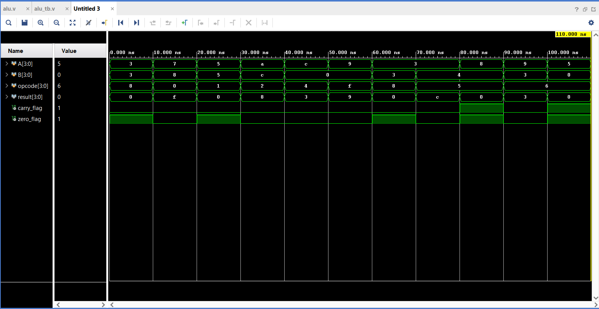

# Waveform Results

This document presents annoated simulation waveforms for each added feature in this **4-bit ALU** project. It demonstrates how each operation is executed in the simulation, providing insights into the ALU's functionality and flag behaviour.

---

## Original ALU (Arithmetic Logic Unit) with multiplication/division capabilities

**Description**

**From 0-10ns**: